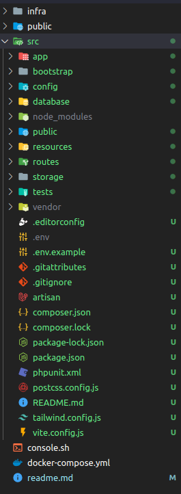

<div>
  <div align="center" display="flex">
    <a href="https://laravel.com/">
      
    </a>
  </div>

  <h1 align="center">Docker Laravel Alpine PHP-FPM</h1>

  <h4 align="center">
    Alpine Linux, <a href="https://www.php.net/manual/en/install.fpm.php">PHP-FPM</a> <a href="https://www.php.net/ChangeLog-8.php#PHP_8_2">8.2</a> with essential extensions, <a href="https://www.postgresql.org/docs/">Postgres</a>, <a href="https://redis.io/">Redis</a> and <a href="https://mailpit.axllent.org/">Mailpit</a>. 🐘
  </h4>
</div>

### Uma estrutura com docker para projetos laravel.

Faça o download ou clone do repositorio e crie o projeto laravel dentro da pasta src


### Configuração do projeto laravel
```
./console.sh composer install
./console.sh php artisan key:generate

#env
DB_CONNECTION=pgsql
DB_HOST=db
DB_PORT=5432
DB_DATABASE=postgres
DB_USERNAME=postgres
DB_PASSWORD=postgres

./console.sh php artisan migrate
```

a infra de prod é a mesma de dev, mas com algumas configurações diferentes.

### utils
```
chmod 777 console.sh
sudo chown -R $USER:www-data infra/*
./console.sh composer install
./console.sh ./vendor/bin/pest 
sudo chmod 777 -R storage
```
